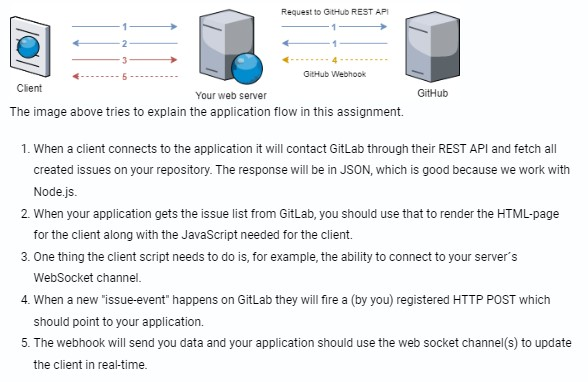
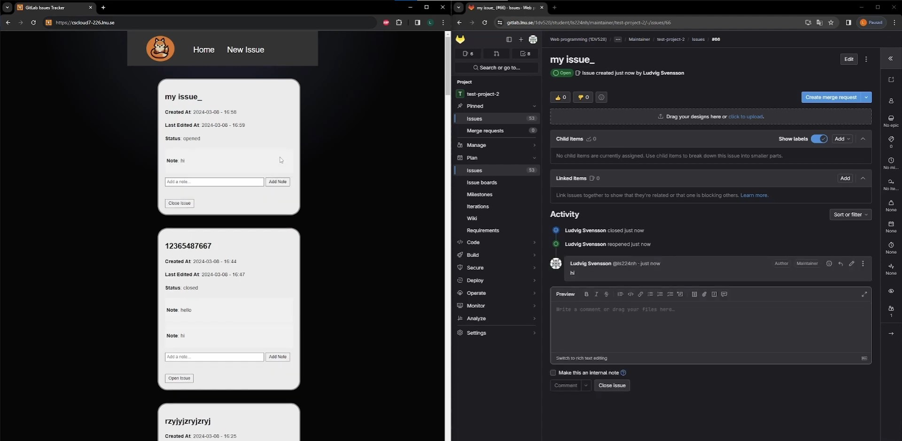

# Real-Time Web Application with GitLab Integration
This is a web application that fetches issues from a GitLab repository using the GitLab REST API and updates the client in real-time using GitLab Webhooks and WebSocket technology. The application is published on a real (public) production server.

## Features
- Fetches issues from a GitLab repository and renders them on the client-side
- Real-time updates of issues using GitLab Webhooks and WebSocket
- Allows creating new issues and adding comments to existing issues from the client-side
- Supports closing and reopening issues from the client-side

##

##
### Credits
This application was developed as part of a web programming course assignment at Linnaeus University.
